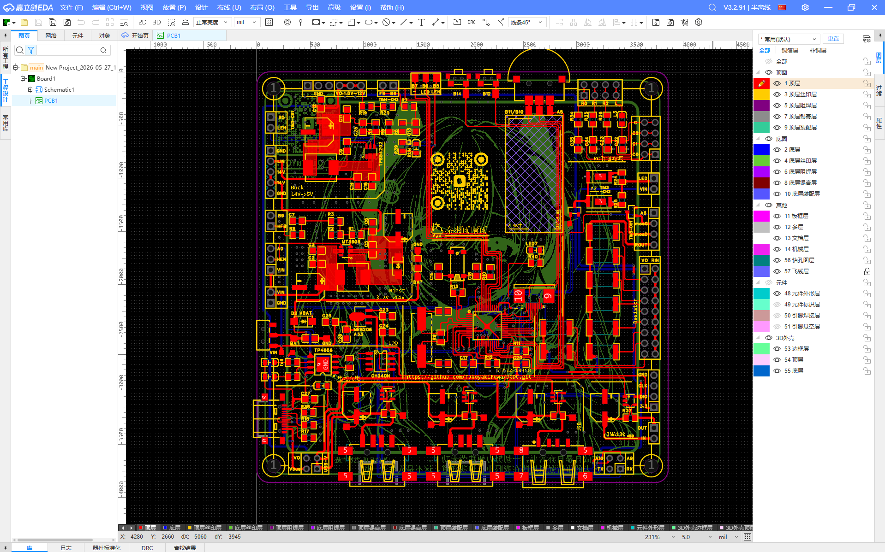
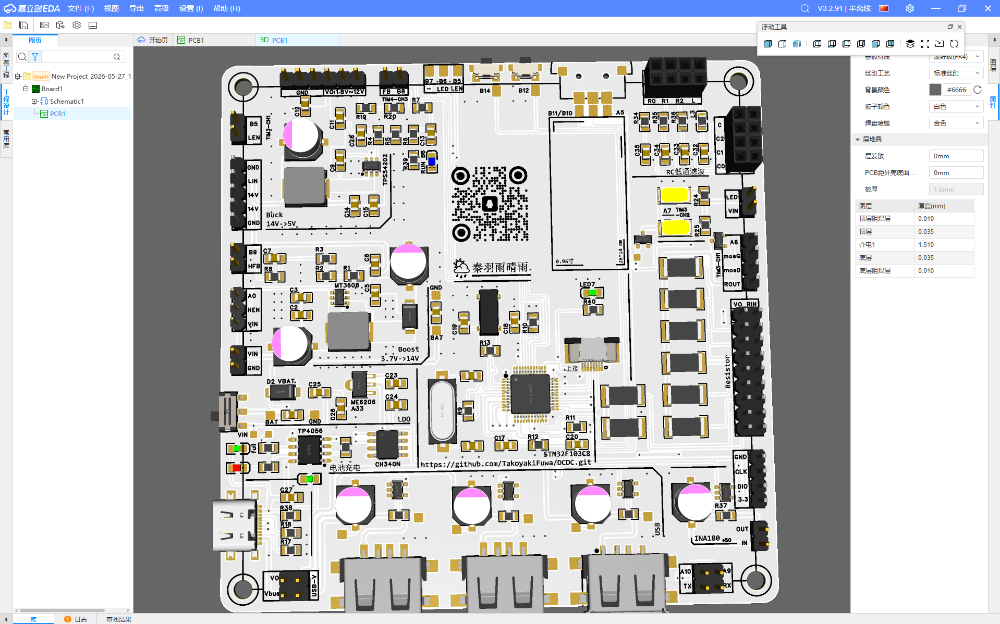
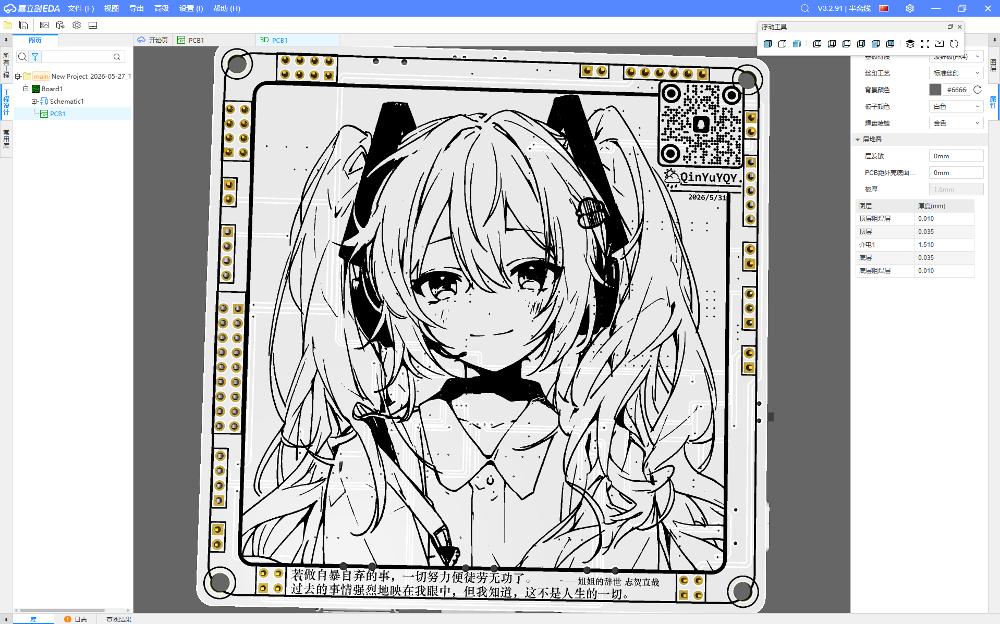

<hr>           

## EDA:
                   

                  

                         

<br>                    

### **丝印**：          


<hr>     

2026/5/27-11:12             
	打算是...做一个...数控电源...(?            
```
需求是把3.6V~5V的电池/TypeC输入转成1.8V~12V的输出             

电流大概1A....最大12V*1A = 12W....别吧....             
嘛...先整额定电流500mA这样                                 
	实现方案是：              
前级用Boost固定升压到14V(500mA)             
后级再通过Buck电路降压到1.8V~12V(500mA)	       
在Buck电路的反馈电路动手 用stm32实现数控电源       
                                             
——前级——(3.6V~5v -> 14V)          
选用芯片MT3608->1.2MHz          
	关于前级计算：                    
3.6V->14V ,D=(Vo-Vin)/Vo=(14-3.6)/14=0.74           
算电流：Io=(1-D)*Idc ->                     
Idc=Io/(1-D)=0.5/(0.26)=1.92                   
纹波率选r=0.4 -> dI=r*Idc=0.77 Iac=dI/2=0.39           
电感饱和电流Isat=Idc+Iac=2.31,取20%余量(0.462A)           
Isat=2.8A		//好像有点大啊....                   
根据电感公式dI=Et/L，其中Et=Vin*D/f                 
L=(Vin*D)/(f*dI)=(3.6*0.74)/(0.77*1.2)=2.88uH                
                                          
大概2.88uH/2.8A的电感(总感觉数值不合理)               
修正:(担心Boost芯片受不了大电流)                
纹波率选r=0.2 -> dI=r*Idc=0.384A                    
Iast=2.2A                                       
L=(Vin*D)/(f*dI)=(3.6*0.74)/(1.2*0.384)=5.78uH                          
                     
选用4.7uH/5A电感                              
电容选择47uF电解电容+2*22uF-MLCC电容                   
                    
                                       
——后级——(14V -> 1.8V~12V,5V电压下要求800mA)                 
选用芯片TPS54202(500KHz)                                
算占空比:D=Vo/Vin=1.8/14=0.128	//是不是有点太低了                 
直流电流:Idc=Io=2222mA (5*800/1.8=2222)                
电流纹波率r=0.4 dI=888.8mA Iac=444mA                
Isat=2666mA -> Isat=3A                           
根据dI=Vo(1-D)/f*L->L=Vo(1-D)/f*dI                   
L=3.53uH                               
                               
在用纹波率r=0.2算一个值：dI=444.4mA                 
L = Vo*(1-D)/f*dI = 7uH                   
我感觉最后还是会选4.7uH/5A电感...                
                     
选了10uH/5A的电感                          
                               
                 
——分压电阻——                           
这种事情果然交给AI来办比较轻松...                 
140K和6.34K把14V分压成0.6V                
73.2K和10K把5V分压成0.6V                 
然后用1K+10uF做低通滤波器，                
+5.1K电阻注入电流来实现数控               
                      
     
```

——关于其他内容——                      
                             
模电方面：因为扩展坞电路板的电流计出现了：                 
同一根电源线按类似串联的方式依次通过三个供电，              
在远端连入200mA+的大电流负载时，                     
近端断开的端口出现了约15mA的电流             
为了测试该内容，增加了三种布线方式做测试                
->串联依次供电 ->单独布线供电 ->大面积铺铜供电              
相应的需要多个输入点和多个INA180检测电流            
                                         
控制方面：stm32f1作为数控的主控，                       
使用CH340N作为串口通信直接把上述关于模电的内容发给电脑              
                                                    
更还有：纹波测试/抗干扰测试/掉压(输出阻抗)测试等电路            
                                                 
                  
5/29-11:04                
因为要应付期末考试                     
打算今天着急一点 赶工大概四小时把这个电路板结束....            
昨晚失眠的时候就在考虑，这个电路板尽量使用贴片元件，          
背面平滑一点....                                            
然后还有承担一些....关于那个3.5寸屏幕的提前测试内容                         
包括：灯珠/贴片TypeA母座/VBAT晶振/mos管	                  
                                      
                    
5/31-19:50                                    
....5/29那次更新完日志之后...                          
我在5/29那天画了一天板子直到半夜零点多...                          
昨天(5/30)那天...复习了小一会....                            
然后画了一下午的丝印...晚上又在研究香橙派到零点多...                
这张板的布线....hmmm还有一些事...                          
很糟...                                
明天下午的考试 但是没怎么复习...或者说准备(?)                         
嘛...再说吧...

6/21-9:21     
以上内容不更新到日志里吗(?                    
在公司申请了一个电源项目....           
下面是关于这个电源项目的汇报，打算等下做成PPT                   

需求是把11.5V电池电压转换成5V3A给飞控供电          
同时添加电压和电流检测功能  
按照PIXHAWK标准接口是5V 5V I V GND GND       

按照6S电池(22.2V约28V)设计，
Buck拓扑电路如下：


计算过程如下：10V~28V -> 5V/3A
```
占空比D=Voff/(Von+Voff)(经过伏秒定律推导)
Von=Vin-Vo=23V   Voff=Vo=5V
D=5V/28V=0.179
Idc=Io=3A
电流纹波率取r=0.3(在最坏输入电压Vmax=28V情况下)
dI=r*Io=0.9A    
直流电流额定峰值:Imax=Idc+(dI/2)=3.45A
电感饱和电流(取20%余量):Isat=(1+20%)*Imax=4.14A
dI=[Voff*(1-D)]/(f*L)
其中，芯片选用TPS5430，频率f固定为500K
电感值L=[Voff*(1-D)]/(f*dI)=[5V*(1-0.179)]/(500K*0.9)
L=9.12uH
选择标准值偏大的10uH电感，1040封装，Isat=6.5A

电容选型为≥两端电压值*2 
输入为耐压50V的10uF-MLCC电容*2+47uF电解电容
(电解电容用于测试)
输出为耐压10V的22uF-MLCC电容*2+220uF电解电容
```

测试：     
在负载飞控电路板的情况下，     
购买到的降压模块纹波约10.80mV，且有高频纹波如下图示        
当前项目绘制电路板输出纹波约2mV(带有输入47uF电解电容的情况)       
为缩小体积，舍弃输入电解电容后输出纹波约6.8mV，    
且纹波波形平滑，不会有高频噪声，波形如下图示
(555KHz为开关电源芯片TPS5430开关频率)

(纹波标准:可接受50mVpp，推荐20mVpp，Pixhawk标准为10mVpp)
初步测试和降压模块符合标准，   
可将电路用于集成到后续飞控电路板上

注：购买到的降压模块适配10V~60V输入电压(12C)，     
当前项目降低输入电压为10V~28V，满足公司里电池测量到的11.5V，   
同时兼容了22.2V电池(6C)，     
如果后续需要兼容更大电压电池也可以重新计算设计   

电路图&实物图：
(插入五张图片)

补充：
为缩小体积追加绘制了如下图电路板，     
使用TPS54202芯片，尺寸2*3cm，等待后续测试使用
(插入两张图片)


6/27-9:52                 
        周六...于航不知道今天来不来            
把那个测试板的功能都测试的差不多了：           
关于ADC，大电流分开走线确实有效                        
(不过出现了采样不对的问题，感觉像是我INA180型号焊错了)       
关于LED，功率确实很大很亮，可以使用(AO3400控制)            
关于RTC，时钟很准，也发现了1M电阻的问题           
(不能并联1M电阻，会导致晶振不起振)                 
关于三相拨码开关，判定不准确，而且不好焊，不能用         
        另外，关于DCDC的内容：                   
TPS5430很稳定很稳定，甚至可以抑制尖峰电压            
(感觉可能是原理图中的二极管的功劳)              
TPS54202不稳定，甚至可能不能给stm32启动            
还需要测试其他的升降压芯片，                   
考虑是否要和于航商量申请项目再测试            


